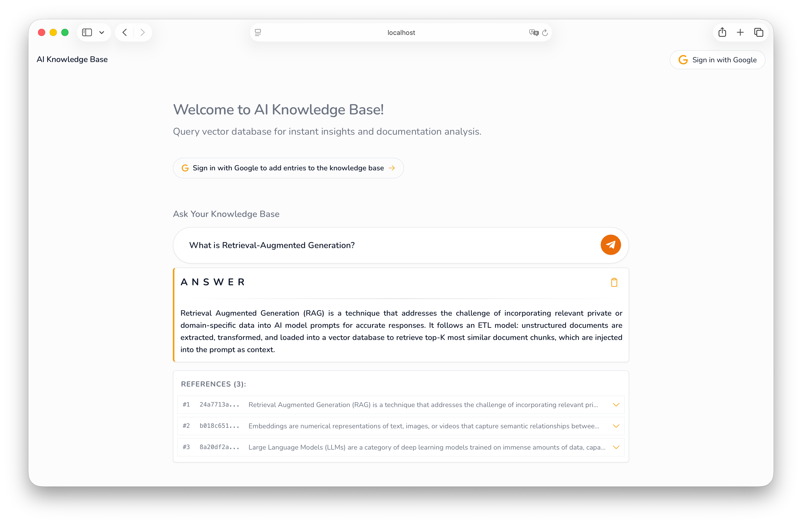
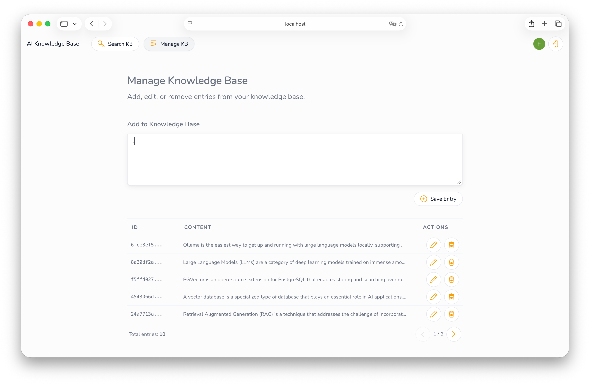
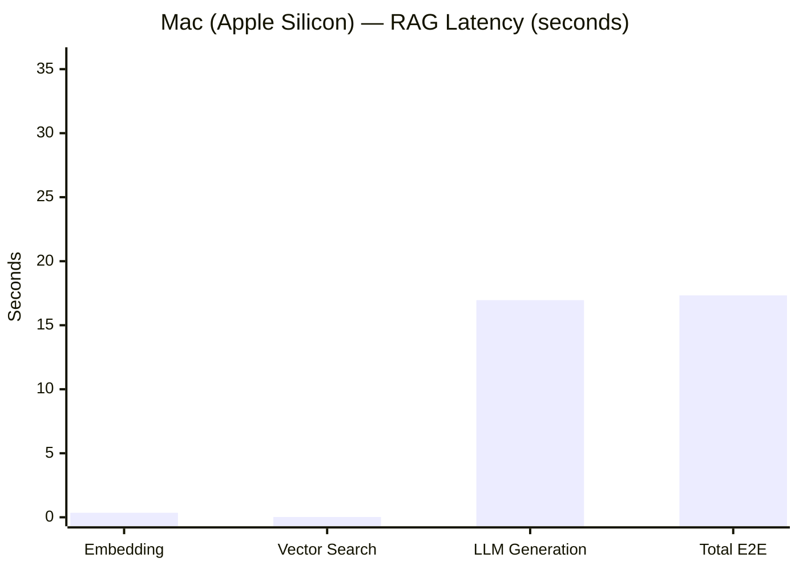
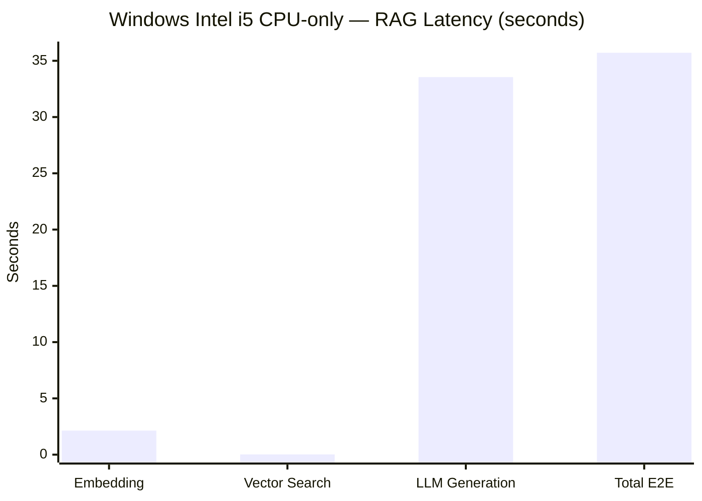
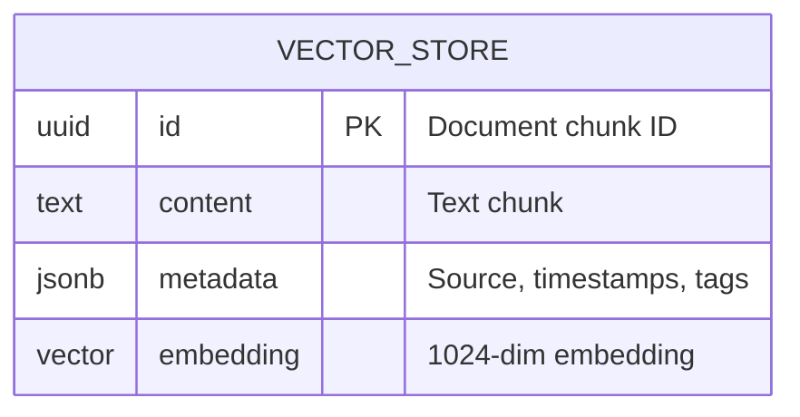

# AI Knowledge Base   

**AI Knowledge Base** is a modern **RAG** (Retrieval-Augmented Generation) platform that allows you to create a private knowledge base powered by your own documents. The application combines the capabilities of **Spring AI** with local LLM (Large Language Models) **Ollama**, eliminating the need to send data to external providers-no OpenAI API key required!

## Screenshots

1. Search Knowledge Base


2. Manage Knowledge Base


## Features

- **Knowledge ingestion** - paste any text; it is split into ~450-character chunks with configurable overlap, embedded and stored in pgvector.
- **Semantic search** - query your knowledge base; the system retrieves the most relevant chunks using cosine similarity.
- **RAG pipeline** - retrieved context is injected into the LLM prompt, grounding answers strictly in your data.
- **Streaming responses** - answers stream token-by-token via SSE (Server-Sent Events) for a smooth UI experience.
- **Source transparency** - every AI response includes the source document chunk and its similarity score.
- **Robust configuration validation** - uses Custom Spring Validators to prevent invalid RAG parameters (like overlap > chunk size) during startup.
- **No-answer detection** - if the similarity threshold (default 0.6) is not met, the LLM call is skipped to avoid hallucinations.
- **Rate limiting** - IP-based token bucket (20 req/min) on all `/api/ai/*` endpoints via Bucket4j.
- **Google OAuth2 login** - secure access via Google account.
- **Fully local** - no OpenAI API key required; runs entirely on your machine with Ollama.
- **Docker Compose** - one command to start the entire stack (App + PostgreSQL with pgvector).

### Project Structure

```text
.
├── ai-frontend/                # React 19 + Vite SPA
│   ├── src/                    # Components (Query, Ingest, Layout), hooks, AuthContext (OAuth2)
│   ├── .env                    # Frontend envs (VITE_API_BASE_URL, VITE_APP_NAME)
│   └── package.json
│
├── src/
│   ├── main/
│   │   ├── java/pl/szelag/ai_knowledge_base/
│   │   │   ├── config/         # Security, RAG properties, and Custom Annotation Validators
│   │   │   ├── controller/     # Auth, ingest, and query (RAG) endpoints
│   │   │   ├── service/        # RAG pipeline (search & query), document processing
│   │   │   ├── repository/     # Vector store access + projections
│   │   │   ├── dto/            # API request/response models
│   │   │   ├── entity/         # JPA entity (VectorStoreEntity - read-only) + vector/JSONB converters
│   │   │   ├── filter/         # Rate limiting (Bucket4j)
│   │   │   └── exception/      # Global exception handling
│   │   │
│   │   └── resources/
│   │       ├── application.yml # Main configuration
│   │       ├── init-vector.sql # pgvector schema + HNSW index
│   │       └── test-data.json  # Seed data for RAG
│   │
│   └── test/
│       └── java/pl/szelag/ai_knowledge_base/
│
├── .env                        # Local secrets (OAuth2 - not committed)
├── benchmark.py                # E2E RAG latency profiler (embedding → pgvector → LLM generation)
├── docker-compose.yml          # Main stack (app + database)
├── docker-compose-test.yml     # Isolated DB for integration tests
├── Dockerfile                  # Backend (Spring Boot)
├── pom.xml                     # Maven dependencies (Spring AI, Ollama, pgvector)
├── test-it.sh                  # Integration tests (Linux/macOS)
└── test-it.ps1                 # Integration tests (Windows)
```

## Architecture

For the full architecture diagram, tech stack, and separation of concerns, see [ARCHITECTURE.md](docs/ARCHITECTURE.md).

## Performance Benchmarks

The pipeline has been tested on **Apple Silicon (M-series)** and **Intel i5 (CPU-only)** to compare hardware acceleration benefits.

### Latency Comparison (End-to-End)





### Key Metrics

| Metric | Mac (M-series) | Windows (i5 CPU) |
| :--- | :---: | :---: |
| **Tokens per second** | **14.53**  | 7.47 |
| **Time to 1st Token** | **0.66s** | 5.51s |
| **Total E2E Time** | **17.33s** | 35.71s |

> [!TIP]
> **Key Insight:** LLM generation is the primary bottleneck (94% of total time). Apple Silicon provides ~2x better performance and near-instant user feedback (UX).

For end-to-end RAG latency analysis and CPU-only performance breakdown, see [BENCHMARKING.md](docs/BENCHMARKING.md).

## Quick Start

### Prerequisites

- [Docker Desktop](https://www.docker.com/products/docker-desktop/)
- [Ollama](https://ollama.com/) installed and running locally
- Google OAuth2 credentials ([create here](https://console.cloud.google.com/))
- [Python 3.8+](https://www.python.org/) - required only for `benchmark.py`

### 1. Pull Ollama models

```bash
ollama pull mxbai-embed-large
ollama pull llama3.2:3B
```

### 2. Allow Docker to reach Ollama

By default Ollama only listens on `127.0.0.1`. Docker containers connect via `host.docker.internal`, which Ollama treats as external traffic and rejects. Fix it by setting:

**macOS / Linux:**

```bash
export OLLAMA_HOST=0.0.0.0
```

**Windows (PowerShell):**

```powershell
[Environment]::SetEnvironmentVariable('OLLAMA_HOST', '0.0.0.0', 'User')
```

### 3. Configure .env in the project root:

```env
GOOGLE_CLIENT_ID=your_google_client_id
GOOGLE_CLIENT_SECRET=your_google_client_secret
```

### 4. Start Docker stack

```bash
docker compose up -d --build
```

### 5. Open app

Navigate to `http://localhost:8080`.

## Running Tests

| Test Type                                  | Linux / macOS / WSL / Git Bash | Windows PowerShell |
| ------------------------------------------ | ------------------------------ | ------------------ |
| Unit tests (no Docker)                     | `mvn test`                     | `mvn test`         |
| Unit + Integration tests (Docker required) | `./test-it.sh`                 | `.\test-it.ps1`    |

> Integration tests require Docker and will start a `pgvector` container automatically if needed.
> The scripts will timeout after 30 seconds if the database fails to start - check `docker logs ai-db-test` for details.

**Optional Jacoco coverage report:**

```bash
# Linux / macOS / WSL / Git Bash
open target/site/jacoco/index.html
```

```powershell
# Windows PowerShell
start target\site\jacoco\index.html
```

**Project Highlights**:

- **Standardized Environment**: Uses `.env` for secure configuration.
- **Test Automation**: Dedicated `docker-compose-test.yml` ensures integration tests run in a clean, containerized PostgreSQL environment.
- **DevOps Friendly**: Includes cross-platform scripts (`.sh` / `.ps1`) for seamless developer onboarding.

## Security

For authentication flow, CSRF, CORS, rate limiting, and security headers, see [SECURITY.md](docs/SECURITY.md).

## Data Model (RAG)



Each document is split into chunks → each chunk becomes one row in `vector_store`.

- **Embeddings**: mxbai-embed-large (1024 dimensions)
- **Search**: cosine similarity + HNSW index (pgvector)

→ Full database schema, SQL, indexing strategy, and diagnostics: [DATABASE.md](docs/DATABASE.md)

## Roadmap

- [ ] PDF upload and ingestion
- [ ] Source attribution — show which document chunks were used to generate the answer
- [ ] Graceful fallback when the knowledge base has no relevant context
- [ ] Multi-user knowledge base isolation
- [ ] Document metadata (filename, upload date, category tags)

## License

This project is licensed under the [MIT License](LICENSE).
