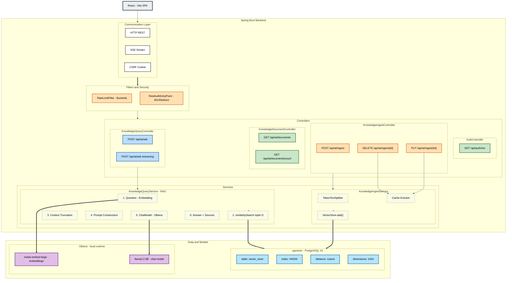

# Architecture

Full system architecture for the AI Knowledge Base RAG application.

## System Diagram

### Overview (Text)
```text
React (Vite SPA)
    │  HTTP (REST) + SSE + CSRF cookie
    ▼
Spring Boot
    ├── Filters & Security
    │   ├── RateLimitFilter              — 20 req/min per IP (Bucket4j)
    │   └── RestAuthenticationEntryPoint — 401 for /api/*, redirect for web
    │
    ├── Controllers
    │   ├── AuthController
    │   │       GET  /api/auth/me
    │   │
    │   ├── KnowledgeIngestController
    │   │       POST   /api/ai/ingest
    │   │       PUT    /api/ai/ingest/{id}
    │   │       DELETE /api/ai/ingest/{id}
    │
    ├── KnowledgeDocumentController
    │   │       GET    /api/ai/documents
    │   │       GET    /api/ai/documents/count
    │   │
    │   └── KnowledgeQueryController
    │           POST   /api/ai/ask
    │           POST   /api/ai/ask-streaming (SSE)
    │
    ├── Services
    │   ├── KnowledgeIngestService
    │   │       TokenTextSplitter(dynamic via app.splitter)
    │   │       → VectorStore.add()
    │   │       → cache eviction on updates
    │   │
    │   └── KnowledgeQueryService (RAG pipeline)
    │           question
    │             → embedding
    │             → similaritySearch(topK=3, threshold=0.60)
    │             → context truncation (max 3000 chars)
    │             → prompt (system + user)
    │             → ChatModel
    │             → answer + sources
    │
    ▼
Data & Models

pgvector (PostgreSQL 16)        Ollama (local runtime)
  ├── table:      vector_store      ┌──────────────────────────────────────┐
  ├── index:      HNSW              │  mxbai-embed-large  (embeddings)     │
  ├── distance:   cosine            │  llama3.2:3B        (chat model)     │
  └── dimensions: 1024              └──────────────────────────────────────┘
```

### Component Diagram (Interactive)



**Separation of concerns:**

- React handles presentation only
- Spring Boot owns all business logic, vectorisation and LLM communication
- pgvector stores and indexes embeddings (HNSW index + GIN on metadata)
- Ollama runs both models locally — no cloud dependency

## Tech Stack

| Layer           | Technology                                                        |
| --------------- | ----------------------------------------------------------------- |
| Frontend        | React 19, Vite                                                    |
| Backend         | Java 21, Spring Boot 3.4.1, Spring AI 1.0-M5                      |
| Vector DB       | PostgreSQL 16 + pgvector (HNSW index, cosine distance, 1024dim)   |
| Embedding model | mxbai-embed-large via Ollama (1024 dimensions, 512 token limit)   |
| Chat model      | llama3.2:3B via Ollama                                            |
| Auth            | Spring Security + Google OAuth2 (session-based)                   |
| Rate limiting   | Bucket4j (token bucket, per IP)                                   |
| Caching         | Spring Cache (`documentCount`, `documents`)                       |
| Infrastructure  | Docker Compose                                                    |

---

← [Back to README](../README.md)
