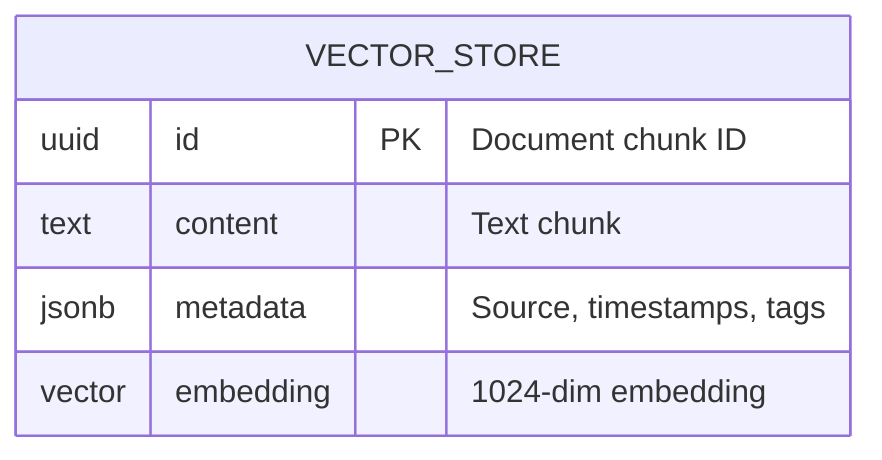
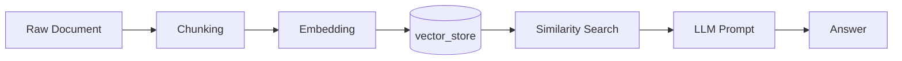

# Database Design

## Overview

The system uses **PostgreSQL + pgvector** to store document embeddings and perform similarity search for RAG. Each document is split into chunks, and each chunk is stored as a separate row with its corresponding high-dimensional embedding.

---

## ERD



## RAG Flow



> [!IMPORTANT]
> **Robust Configuration Validation**: The chunking process (Stage B) is strictly controlled by `app.splitter` properties. The system employs **Custom Spring Validators** that perform cross-field validation (e.g., ensuring `min-chunk-size < chunk-size`) during the Spring context startup. If the configuration in `application.yml` is logically inconsistent, the application will fail-fast and refuse to start, preventing corrupted data ingestion.

## Schema (pgvector)

```sql
CREATE EXTENSION IF NOT EXISTS vector;

CREATE TABLE IF NOT EXISTS vector_store (
    id uuid NOT NULL PRIMARY KEY,
    content text,
    metadata jsonb,
    embedding vector(1024)
);
```

> [!WARNING]  
> Embedding dimension is hardcoded to **1024** - must match your model output.  
> `mxbai-embed-large` → 1024 ✓ | If you switch models, update `vector(1024)` and recreate the table + HNSW index.

## HNSW Index (Similarity Search)

```sql
CREATE INDEX IF NOT EXISTS vector_store_embedding_idx
ON vector_store USING hnsw (embedding vector_cosine_ops)
WITH (m = 16, ef_construction = 128);
```

- **HNSW** = Hierarchical Navigable Small World, providing fast approximate nearest neighbor search.
- **Cosine similarity** = The distance metric used for comparing vectors (`vector_cosine_ops`).
- **Tuning**: Parameters `m` and `ef_construction` are aligned with`spring.ai.vectorstore.pgvector.hnsw-params`in`application.yml`.

## Additional Indexes

```sql
-- GIN index for fast filtering on metadata JSONB fields
CREATE INDEX IF NOT EXISTS vector_store_metadata_idx
ON vector_store USING gin (metadata);

-- Functional index for sorting by ingestion date
CREATE INDEX IF NOT EXISTS vector_store_ingested_at_idx
ON vector_store (((metadata->>'ingested_at')::bigint) DESC);
```

## Diagnostic Commands (Run via Docker/psql)

```sql
-- Connect:
docker exec -it postgres-pgvector psql -U user -d ai-db

-- Table structure
\d vector_store

-- Check index usage & execution plan:
EXPLAIN ANALYZE
SELECT content
FROM vector_store
ORDER BY embedding <=> array_fill(0, ARRAY[1024])::vector
LIMIT 1;

-- Preview sample data:
SELECT content, metadata FROM vector_store LIMIT 1;

-- Wipe all data:
TRUNCATE TABLE vector_store;
```

## Notes

- **Embeddings**: Uses `mxbai-embed-large` (1024 dimensions) by default via Ollama.
- **Distance metric**: Cosine similarity (optimal for normalized embeddings).
- **Retrieval Strategy**: Top-K similarity search powered by the HNSW index.
- **Configurability**: All retrieval thresholds (`similarity`, `top-k`) and chunking rules are defined in `application.yml` under `app.rag` and `app.splitter` prefixes.
- **Extensibility**: The `metadata` JSONB column allows for advanced filtering without changing the core schema.

---

← [Back to README](../README.md)